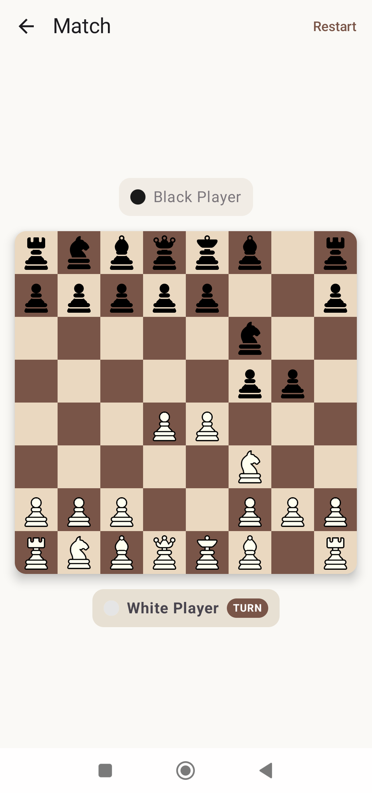

# Chess Android App



A modern Chess application for Android, built with Jetpack Compose and Firebase.

## Features

- Online Multiplayer (Firebase Realtime Database)
- Google Sign-In
- Modern UI with Jetpack Compose Material 3
- Clean Architecture / MVI

## Tech Stack

- **Kotlin**: Core language.
- **Jetpack Compose**: UI toolkit.
- **Hilt**: Dependency injection.
- **Firebase**: Authentication and Realtime Database.
- **DataStore**: Local preferences.
- **Coroutines & Flow**: Asynchronous programming.

## Getting Started

### Prerequisites

- Android Studio Ladybug (or newer)
- JDK 21
- A Firebase project

### Setup

1.  **Clone the repository**:
    ```bash
    git clone https://github.com/your-username/chess-android.git
    ```

2.  **Firebase Configuration**:
    - Go to the [Firebase Console](https://console.firebase.google.com/).
    - Add an Android app to your project with package name `it.ric.chess`.
    - Download the `google-services.json` file and place it in the `app/` directory.

3.  **Local Properties**:
    - Copy `local.properties.example` to `local.properties`.
    - Set your `WEB_CLIENT_ID` in `local.properties`. You can find this in the Firebase Console under Authentication > Sign-in method > Google > Web SDK configuration.

4.  **Build and Run**:
    - Open the project in Android Studio.
    - Sync Gradle and run the `app` module.

## License

This project is licensed under the MIT License - see the [LICENSE](LICENSE) file for details.
