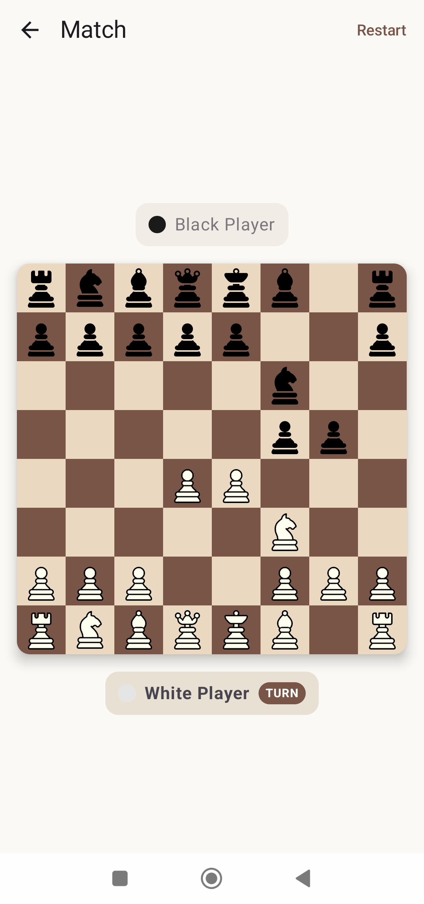
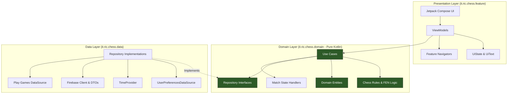

# Chess Android App



A modern Chess application for Android, built with Jetpack Compose and Firebase.

## Features

- Online Multiplayer (Firebase Realtime Database)
- Google Sign-In & Play Games Integration
- Modern UI with Jetpack Compose Material 3
- Clean Architecture & Unidirectional Data Flow (UDF)

## Tech Stack

- **Kotlin**: Core programming language.
- **Jetpack Compose**: Declarative UI toolkit.
- **Hilt**: Dependency injection framework.
- **Firebase**: Authentication and Realtime Database.
- **DataStore**: Type-safe local preferences storage.
- **Coroutines & Flow**: Reactive asynchronous state streams.

---

## Architecture

This project strictly adheres to **Clean Architecture** principles and modern Android architecture guidelines, enforcing a strict unidirectional dependency flow and complete domain purity.


```mermaid
graph TD
    subgraph Presentation ["Presentation Layer (it.ric.chess.feature)"]
        UI["Jetpack Compose UI"] --> VM["ViewModels"]
        VM --> State["UiState & UiText"]
        VM --> Nav["Feature Navigators"]
    end

    subgraph Domain ["Domain Layer (it.ric.chess.domain - Pure Kotlin)"]
        VM --> UC["Use Cases"]
        UC --> Rules["Chess Rules & FEN Logic"]
        UC --> Models["Domain Entities"]
        UC --> Repos["Repository Interfaces"]
        UC --> Handler["Match State Handlers"]
    end

    subgraph Data ["Data Layer (it.ric.chess.data)"]
        RepoImpl["Repository Implementations"] .->|Implements| Repos
        RepoImpl --> PrefsDS["UserPreferencesDataSource"]
        RepoImpl --> Time["TimeProvider"]
        RepoImpl --> FirebaseDS["Firebase Client & DTOs"]
        RepoImpl --> PlayGamesDS["Play Games DataSource"]
    end

    classDef pure fill:#2d5a27,stroke:#333,stroke-width:1px,color:#fff;
    class Models,UC,Repos,Rules pure;
```

### Architectural Highlights

- **Pure Kotlin Domain (`it.ric.chess.domain`)**: The domain layer has zero dependencies on Android, Compose, Firebase, or external frameworks.
- **Use Case Driven**: ViewModels communicate with data repositories exclusively through granular, single-responsibility Use Cases.
- **Encapsulated Data Layer (`it.ric.chess.data`)**: Local storage (`UserPreferencesDataSource`), remote storage (`Firebase`), and authentication are isolated inside data sources. System clocks are abstracted via `TimeProvider`.
- **Decoupled Navigation**: Navigation relies on Navigation 3 abstractions exposed to ViewModels through feature-level navigator interfaces.
- **Unidirectional Data Flow (UDF)**: UI state is reactively produced using Kotlin `StateFlow` and bound seamlessly to Compose UI components.

---

## Getting Started

### Prerequisites

- Android Studio Ladybug (or newer)
- JDK 21
- A Firebase project

### Setup

1. **Clone the repository**:
   ```bash
   git clone https://github.com/your-username/chess-android.git
   ```

2. **Firebase Configuration**:
   - Go to the [Firebase Console](https://console.firebase.google.com/).
   - Add an Android app to your project with package name `it.ric.chess`.
   - Download the `google-services.json` file and place it in the `app/` directory.

3. **Local Properties**:
   - Copy `local.properties.example` to `local.properties`.
   - Set your `WEB_CLIENT_ID` in `local.properties`. You can find this in the Firebase Console under Authentication > Sign-in method > Google > Web SDK configuration.

4. **Build and Run**:
   - Open the project in Android Studio.
   - Sync Gradle and run the `app` module.

---

## License

This project is licensed under the MIT License - see the [LICENSE](LICENSE.txt) file for details.
